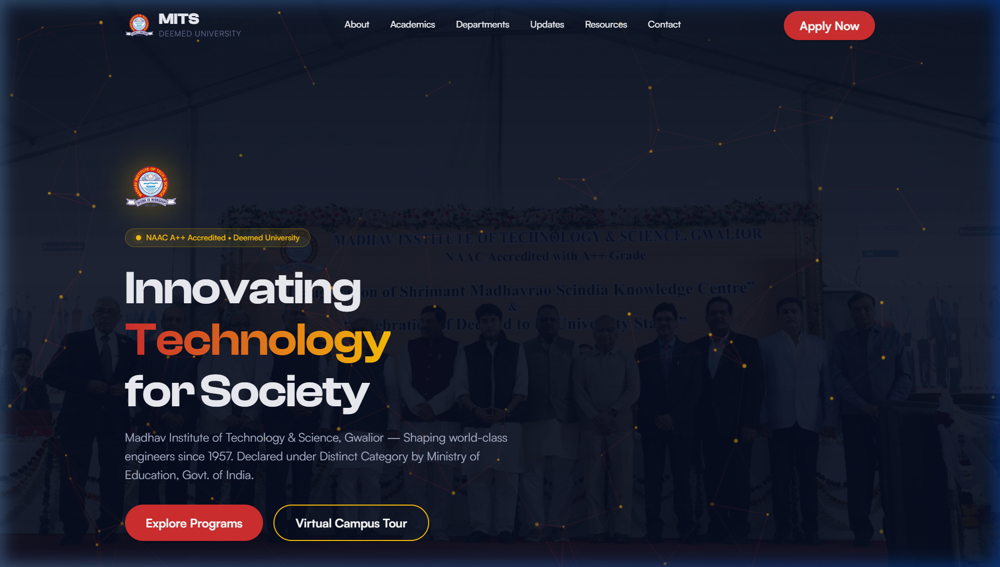
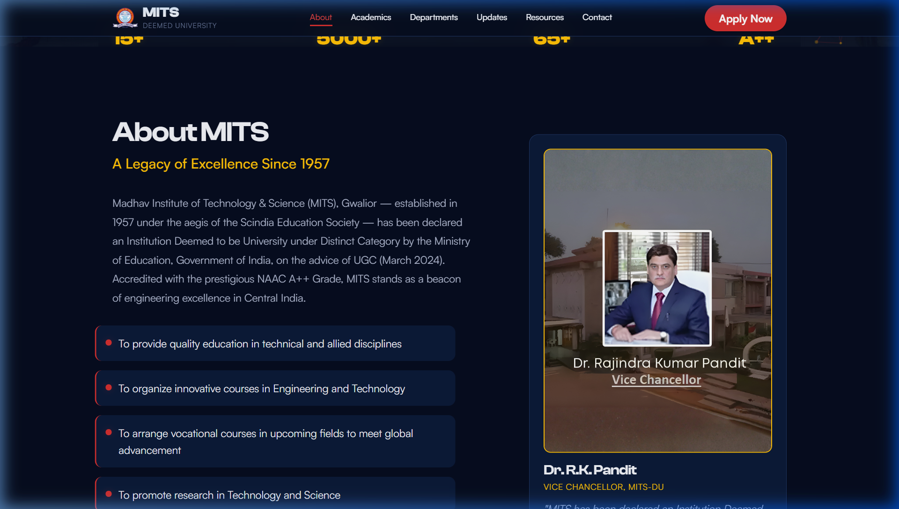
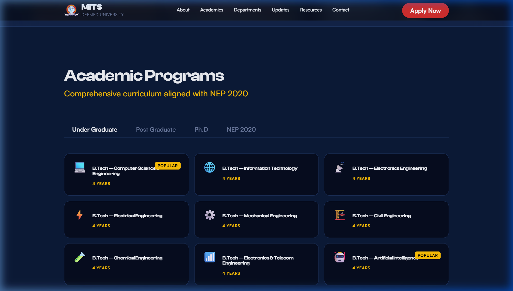
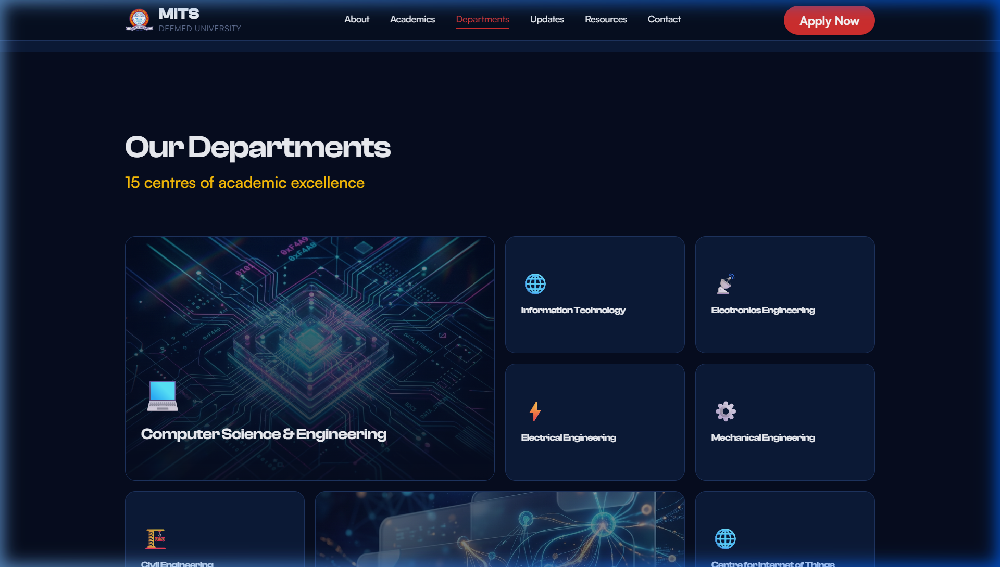
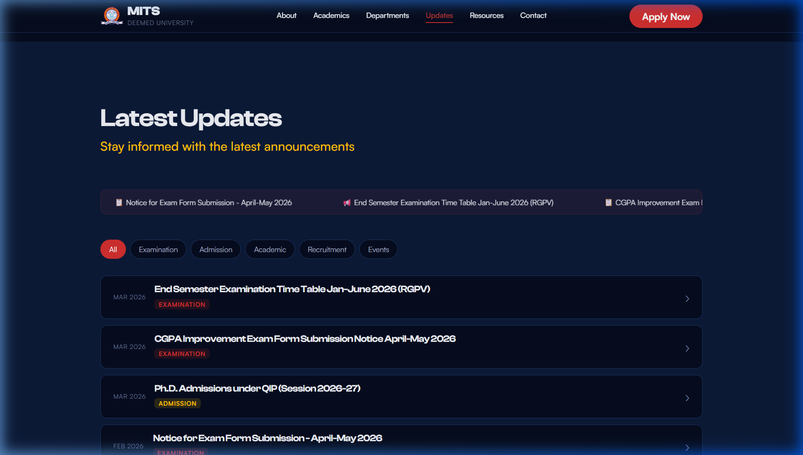
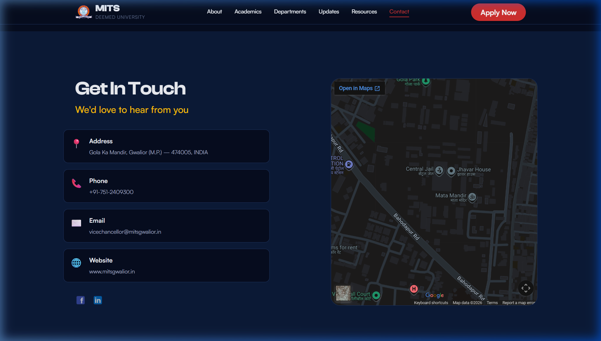

# MITS Gwalior Portal: Student-Centric Landing Page Redesign
**Frontend Battle Project Showcase**

Reference: [https://web.mitsgwalior.in](https://web.mitsgwalior.in)

---

## 1. Problem Description
College websites are a primary source of academic and institutional information for students, but many suffer from poor navigation, scattered content, and low usability. Important resources like course schemes, academic details, and updates are often difficult to access and not structured for quick understanding. 

**The Challenge:** 
Redesign and develop a modern, student-centric landing page that improves accessibility, organization, and usability of information. The goal was to create an intuitive and efficient interface that helps students quickly find academic resources, updates, and essential information without merely replicating the existing legacy website.

---

## 2. Design Philosophy & Approach
Our approach centered around **"Information Architecture through Visual Hierarchy."** 

We transitioned the portal from a dense, text-heavy directory into a highly visual, modular dashboard. Inspired by premium tech-focused universities, the new design leverages a sleek dark-mode aesthetic adorned with vibrant gold and blue accents. This not only reduces cognitive overload for students but significantly increases the readability of critical announcements, curriculum changes, and department highlights.

We implemented massive "Bento Box" style grids, smooth semantic HTML structuring, and zero-dependency Vanilla JavaScript to ensure lightning-fast load times.

---

## 3. Key Features & Visual Walkthrough

### 3.1 Hero Section & Navigation
**Solution:** The new sticky, transparent navbar provides instant access to all core sections (`About`, `Academics`, `Departments`, `Contact`). The Hero section introduces the college's legacy powerfully, pushing the most sought-after actions ("Explore Programs" & "Virtual Campus Tour") directly above the fold. 
*(Below: The sticky navbar and atmospheric hero landing)*

### 3.2 About MITS & Quick Stats
**Solution:** Rather than burying the college's legacy in a text wall, we extracted the most impressive data points (1957 Founding, NAAC A++ Grade, 65+ Years Legacy) into an animated statistics grid. The Vice Chancellor's message was placed elegantly alongside to maintain institutional authority without cluttering data retrieval.

### 3.3 Academics / Schemes Section
**Solution:** Academic frameworks are notoriously hard to navigate. We solved this by using an interactive **Tabbed Interface** dividing programs into *Undergraduate*, *Postgraduate*, and *Doctoral*. We also included a dedicated NEP 2020 highlight panel to clearly explain modern flexible curriculums, minor specializations, and Novel Engaging Courses (NEC).

### 3.4 Departments Section
**Solution:** The 15 academic departments were reorganized into a vast, easily scannable "Bento Grid". We generated **custom AI thumbnails** for flagship departments like Computer Science & Engineering and the Centre for Artificial Intelligence to make the interface feel highly modern and visually distinguished. Furthermore, clicking on any department routes the student to a *dedicated, fully-structured sub-page* containing specific laboratory, curriculum, and leadership details.

### 3.5 Announcements / Updates Section
**Solution:** Crucial university notices are now sorted intuitively using a sticky sidebar layout. The updates feed supports categorized pill-tags (e.g., `Exam`, `Notice`, `Event`) allowing students to instantly filter the noise and find precisely what is relevant to them right now.

### 3.6 Student Resources & Footer
**Solution:** Quick-access links to the Moodle LMS, Library Web OPAC, and Academic Calendars were centralized at the bottom. The Footer includes a robust, responsive Google Maps embedding and clear, semantic contact hierarchies so students or parents can immediately reach the correct administrative phone lines.

---

## 4. Technical Architecture
In accordance with the competition's functional requirements, the project was built utilizing deeply optimized web standards:
- **Semantic HTML5:** Built using rigorous `<section>`, `<article>`, `<nav>`, and `<header>` structure to guarantee maximum SEO compliance and screen-reader accessibility.
- **Pure CSS Layouts:** Implemented using a custom flexbox and CSS Grid design system driven by CSS variables (`--bg-primary`, `--accent-gold`). It does **not** rely on heavy frameworks like Bootstrap or Tailwind, establishing incredibly lightweight payload times.
- **Vanilla JavaScript:** All interactive tabs, smooth scrolling mechanisms, and filtering algorithms were hand-written in `js/main.js` to avoid the overhead of libraries like jQuery.
- **Fully Responsive:** Extensive media queries ensure the dashboard is just as readable and interactive on a 360px wide smartphone as it is on a 4K desktop monitor.
- **Robust Subpage System:** All 15 departments have dynamically linked `html` instances seamlessly woven into the root ecosystem.

## 5. Conclusion
This redesign heavily bridges the gap between institutional aesthetic and practical student utility. By replacing confusing mega-menus with visual interactive grids, removing external dependencies to maximize load speeds, and prioritizing critical navigation resources front-and-center, we have established a "student-first" unified portal ready explicitly for MITS Gwalior.
